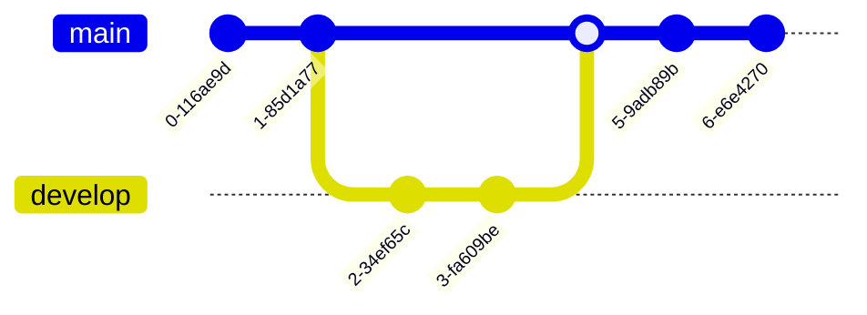
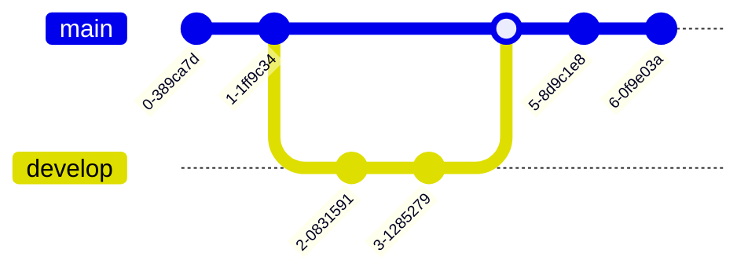

<br />

## Markdown extensions

### SmartyPants

SmartyPants converts ASCII punctuation characters into "smart" typographic
punctuation HTML entities for example:

Syntax:

```plaintext
|                  | ASCII                           | HTML                          |
| ---------------- | ------------------------------- | ----------------------------- |
| Single backticks | `'Isn't this fun?'`             | 'Isn't this fun?'             |
| Quotes           | `"Isn't this fun?"`             | "Isn't this fun?"             |
| Dashes           | `-- is en-dash, --- is em-dash` | -- is en-dash, --- is em-dash |
```

Output:

|                  | ASCII                           | HTML                          |
| ---------------- | ------------------------------- | ----------------------------- |
| Single backticks | `'Isn't this fun?'`             | 'Isn't this fun?'             |
| Quotes           | `"Isn't this fun?"`             | "Isn't this fun?"             |
| Dashes           | `-- is en-dash, --- is em-dash` | -- is en-dash, --- is em-dash |

<br />

### KaTeX

You can render LaTeX mathematical expressions using [KaTeX]:

Syntax:

```plaintext
The _Gamma function_ satisfying $\Gamma(n) = (n-1)!\quad\forall n\in\mathbb N$
is via the Euler integral

$$
\Gamma(z) = \int_0^\infty t^{z-1}e^{-t}dt\,.
$$
```

Output:

The _Gamma function_ satisfying $\Gamma(n) = (n-1)!\quad\forall n\in\mathbb N$
is via the Euler integral

$$
\Gamma(z) = \int_0^\infty t^{z-1}e^{-t}dt\,.
$$


> You can find more information about **LaTeX** mathematical expressions [here].

<br />

### UML diagrams

You can render UML diagrams using [Mermaid] for example, this will produce a
sequence diagram:

Syntax:

````plaintext

````

Output:


And this will produce a flow chart:

Syntax:

````plaintext

````

Output:


<br />

### Sequence diagram

Syntax:

````plaintext
```mermaid
sequenceDiagram
Alice->>John: Hello John, how are you?
loop Healthcheck
    John->>John: Fight against hypochondria
end
Note right of John: Rational thoughts!
John-->>Alice: Great!
John->>Bob: How about you?
Bob-
````

Output:

```mermaid
sequenceDiagram
Alice->>John: Hello John, how are you?
loop Healthcheck
    John->>John: Fight against hypochondria
end
Note right of John: Rational thoughts!
John-->>Alice: Great!
John->>Bob: How about you?
Bob-->>John: Jolly good!
```

<br />

### Gnatt Chart

Syntax:

````plaintext

````

Output:


<br />

### Class diagram

Syntax:

````plaintext

````

Output:


<br />

### State diagram

Syntax:

````plaintext

````

Output:


<br />

### Pie Chart

Syntax:

````plaintext

````

Output:


<br />

### Git Graph

Syntax:

````plaintext

````

Output:



<br />

### Bar chart (using gantt chart)

Syntax:

````plaintext

````

Output:


<br />

### User Journey diagram

Syntax:

````plaintext

````

Output:


<br />

### C4 diagram

Syntax:

````plaintext

````

Output:

```mermaid
C4Context
title System Context diagram for Internet Banking System

Person(customerA, "Banking Customer A", "A customer of the bank, with personal bank accounts.")
Person(customerB, "Banking Customer B")
Person_Ext(customerC, "Banking Customer C")
System(SystemAA, "Internet Banking System", "Allows customers to view information about their bank accounts, and make payments.")

Person(customerD, "Banking Customer D", "A customer of the bank, <br/> with personal bank accounts.")

Enterprise_Boundary(b1, "BankBoundary") {

  SystemDb_Ext(SystemE, "Mainframe Banking System", "Stores all of the core banking information about customers, accounts, transactions, etc.")

  System_Boundary(b2, "BankBoundary2") {
    System(SystemA, "Banking System A")
    System(SystemB, "Banking System B", "A system of the bank, with personal bank accounts.")
  }

  System_Ext(SystemC, "E-mail system", "The internal Microsoft Exchange e-mail system.")
  SystemDb(SystemD, "Banking System D Database", "A system of the bank, with personal bank accounts.")

  Boundary(b3, "BankBoundary3", "boundary") {
    SystemQueue(SystemF, "Banking System F Queue", "A system of the bank, with personal bank accounts.")
    SystemQueue_Ext(SystemG, "Banking System G Queue", "A system of the bank, with personal bank accounts.")
  }
}

BiRel(customerA, SystemAA, "Uses")
BiRel(SystemAA, SystemE, "Uses")
Rel(SystemAA, SystemC, "Sends e-mails", "SMTP")
Rel(SystemC, customerA, "Sends e-mails to")
```

[KaTeX]: https://khan.github.io/KaTeX
[here]:
  http://meta.math.stackexchange.com/questions/5020/mathjax-basic-tutorial-and-quick-reference
[Mermaid]: https://mermaidjs.github.io
